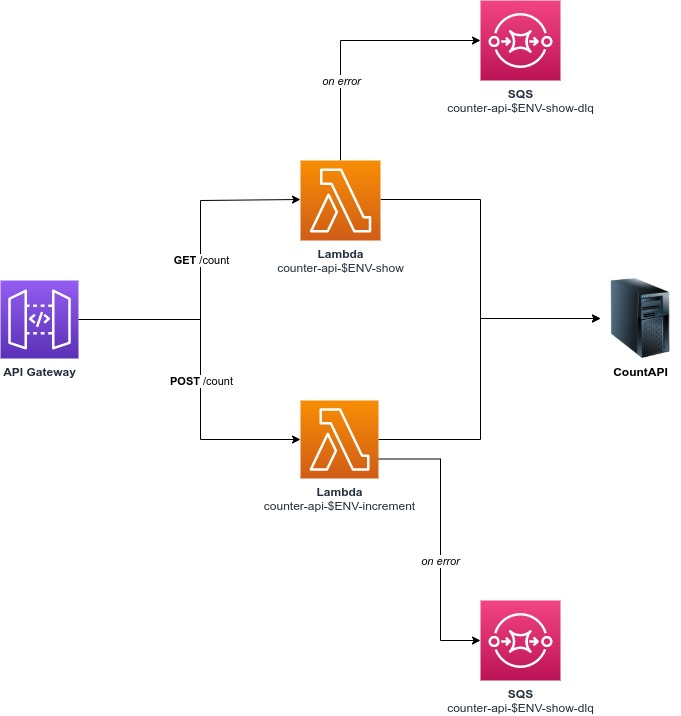
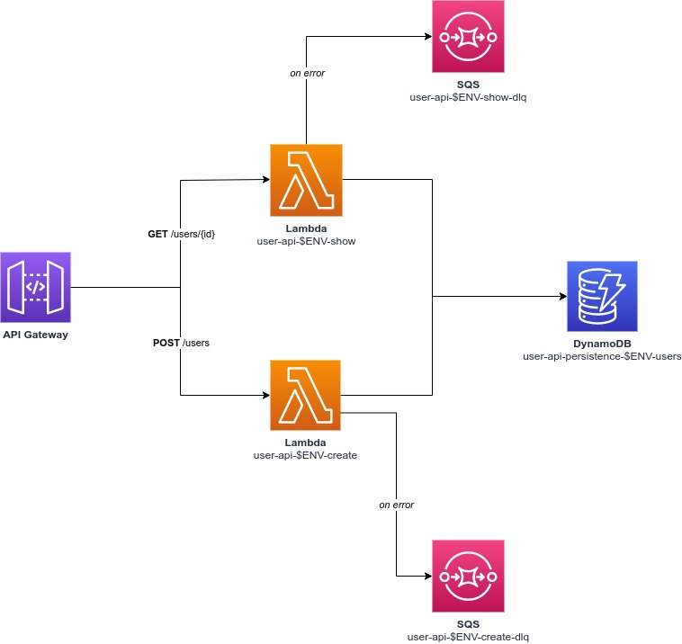

<!-- markdownlint-disable MD024 MD036 -->
# Arquitetura

WIP

## Counter API

### Fluxo

1. Ao receber uma requisição HTTP, o serviço API Gateway invoca o Lambda atrelado ao _path_ do request no método indicado;
2. O lambda faz a comunicação com a CountAPI para buscar a quantidade de acessos registrados (endpoint `GET /count`) ou incrementar o número de acessos (endpoint `POST /count`);
3. Em caso de erro, ele é logado no CloudWatch e enviado para sua respectiva DLQ;

### Dicionário de dados

#### **Requests**

_Não se aplica_

#### **Responses**

`GET /count`:

| Campo | Tipo | Sempre será retornado? | Descrição                     |
|-------|------|------------------------|-------------------------------|
| value | int  | Sim                    | Número de acessos registrados |

`POST /count`:

| Campo    | Tipo | Sempre será retornado? | Descrição                                |
|----------|------|------------------------|------------------------------------------|
| newValue | int  | Sim                    | Número de acessos registrados atualizado |

## User API

### Fluxo

1. Ao receber uma requisição HTTP, o serviço API Gateway invoca o Lambda atrelado ao _path_ do request no método indicado;
2. Em `GET /users/{id}`, o Lambda é responsável por buscar o usuário com o ID informado no banco de dados. Caso não encontrado, é retornado o status HTTP 404 e uma mensagem como JSON;
3. Em `POST /users`, é realizado a validação e inserção do novo usuário no banco de dados. Em caso de erro de validação, é retornado uma lista de `errors` em formato JSON. Em outros casos de erro, é retornado um JSON com a mensagem no campo `message`;
4. Em caso de erro, ele é logado no CloudWatch e enviado para sua respectiva DLQ;

### Dicionário de dados

#### **Requests**

`GET /users/{id}`:

| Parâmetro | Tipo   | Obrigatório? | Descrição     |
|-----------|--------|--------------|---------------|
| id        | string | Sim          | ID do usuário |

`POST /users`:

| Campo    | Tipo   | Obrigatório? | Descrição               |
|----------|--------|--------------|-------------------------|
| name     | string | Sim          | Nome completo da pessoa |
| email    | string | Sim          | E-mail da pessoa        |
| password | string | Sim          | Senha de acesso         |

#### **Responses**

`GET /users/{id}`:

| Campo     | Tipo            | Sempre será retornado? | Descrição                                  |
|-----------|-----------------|------------------------|--------------------------------------------|
| id        | UUID string     | Sim                    | ID do usuário                              |
| name      | string          | Sim                    | Nome completo da pessoa                    |
| email     | string          | Sim                    | E-mail da pessoa                           |
| enabled   | boolean         | Sim                    | Indica se o usuário está habilitado ou não |
| createdAt | ISO Date string | Sim                    | Data de criação da conta                   |
| updatedAt | ISO Date string | Sim                    | Data da última atualização dos dados       |

`POST /users`:

| Campo     | Tipo            | Sempre será retornado? | Descrição                                  |
|-----------|-----------------|------------------------|--------------------------------------------|
| pk        | string          | Sim                    | Chave primária da tabela (partition key), composta por "EMAIL#o-email-cadastrado"   |
| id        | UUID string     | Sim                    | ID do usuário                              |
| name      | string          | Sim                    | Nome completo da pessoa                    |
| email     | string          | Sim                    | E-mail da pessoa                           |
| enabled   | boolean         | Sim                    | Indica se o usuário está habilitado ou não |
| createdAt | ISO Date string | Sim                    | Data de criação da conta                   |
| updatedAt | ISO Date string | Sim                    | Data da última atualização dos dados       |
